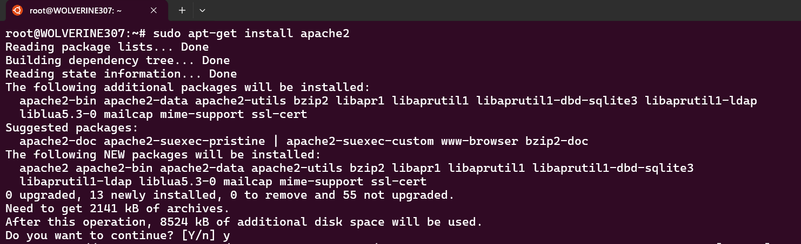
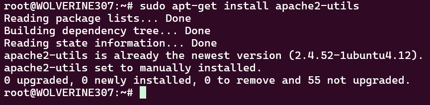
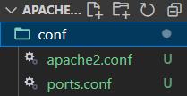
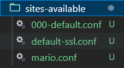
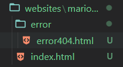

# Apache Virtual Host
En primer lugar debemos instalar Apache en la Terminal de Ubuntu
```
sudo apt-get install apache2
```


y sus utilidades
```
sudo apt-get install apache2-utils
```



## VH1 mario.com
Para la VH1 creamos la siguiente estructura de carpetas

```
├── conf
├── sites-available
├── websites
│   ├── mario.com
│       ├── error
├── scripts
```

primero la carpeta "conf" y dentro copiamos los archivos "apache2.conf" "ports.conf"
<br>



En sites avalable coopiamos los archivos conf default y nuestro conf para el Web Host mario.conf
<br>


En la carpeta Websites dentro de mario.com pondremos nuestra pagina web para mario.com "index.html" y dentro de error la pagina que muestra el error 404
<br>


Entrando en el archivo conf pondremos lo siguiente<br>


En la carpeta scripts el archivo entrypoint.sh con el siguiente contenido

```
  #!/bin/bash
  
  # Habilitar los sitios
  a2ensite natalia.conf
  
  # Deshabilitar los sitios que no deseamos
  # a2dissite 000-default.conf
  # a2dissite default-ssl.conf
  
  # Habilitamos ssl
  a2enmod ssl
  
  # Recargar la configuración de Apache
  service apache2 reload
  
  # Iniciar Apache en primer plano
  apache2ctl -D FOREGROUND
```

Ademas creamos nuestro archivo docker-compose.yml
```
services:
  web:
    image: ubuntu/apache2
    container_name: apache_server
    ports:
      - "8085:80"
      - "8443:443"
    volumes:
      - ./conf/apache2.conf:/etc/apache2/apache2.conf # archivo de configuración principal
      - ./conf/ports.conf:/etc/apache2/ports.conf # archivo de configuración de puertos
      - ./sites-available:/etc/apache2/sites-available # archivos de configuración de hosts virtuales
      - ./websites:/var/www/html/ # directorio de los sitios web
      - ./scripts:/scripts # directorio de scripts
      - ./htpasswd/.htpasswd:/etc/apache2/.htpasswd # archivo de contraseñas
      - ./certs:/etc/apache2/certs # directorio de certificados (hechos con openssl)
    restart: always
    entrypoint: /scripts/entrypoint.sh # script de inicio
```

El archivo de hosts en C:\Windows\System32\drivers\etc\hosts. 
Lo editaremos con permisos de administrador, añadiendo:

```127.0.0.1 mario.com```

