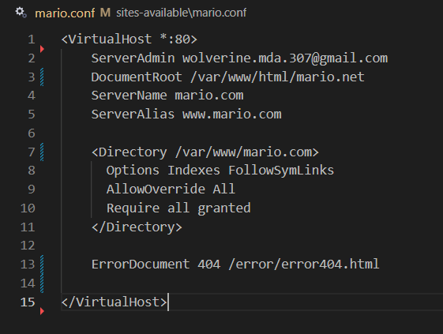
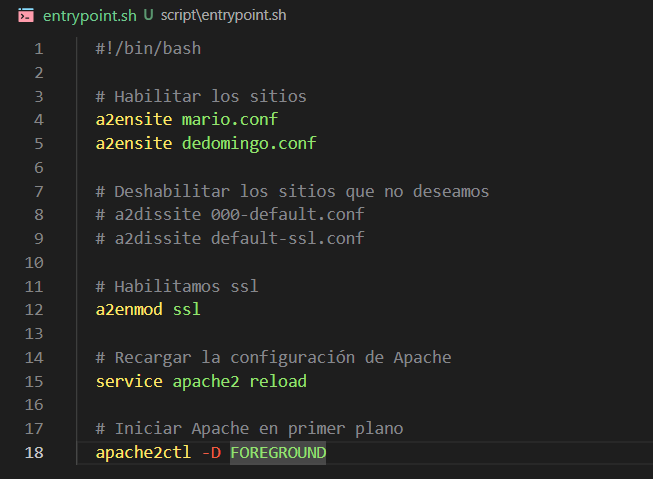
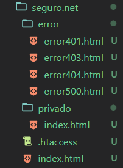
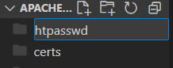
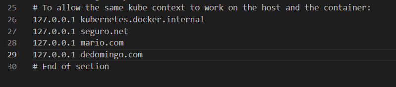

# Apache Virtual Host

## VH1 mario.com
Para la VH1 creamos la siguiente estructura de carpetas

```
├── conf
├── sites-available
├── websites
│   ├── mario.com
│       ├── error
├── scripts
```

- primero la carpeta "conf" y dentro copiamos los archivos "apache2.conf" "ports.conf"
<br><br>


- En sites avalable coopiamos los archivos conf default y nuestro conf para el Web Host mario.conf
<br><br>


- En la carpeta Websites dentro de mario.com pondremos nuestra pagina web para mario.com "index.html" y dentro de error la pagina que muestra el error 404
<br><br>


- Entrando en el archivo conf pondremos lo siguiente<br><br>


- En la carpeta scripts el archivo entrypoint.sh con el siguiente contenido

```
  #!/bin/bash
  
  # Habilitar los sitios
  a2ensite mario.conf
  
  # Deshabilitar los sitios que no deseamos
  # a2dissite 000-default.conf
  # a2dissite default-ssl.conf
  
  # Habilitamos ssl
  a2enmod ssl
  
  # Recargar la configuración de Apache
  service apache2 reload
  
  # Iniciar Apache en primer plano
  apache2ctl -D FOREGROUND
```

- Ademas creamos nuestro archivo docker-compose.yml
```
services:
  web:
    image: ubuntu/apache2
    container_name: apache_server
    ports:
      - "8085:80"
      - "8443:443"
    volumes:
      - ./conf/apache2.conf:/etc/apache2/apache2.conf # archivo de configuración principal
      - ./conf/ports.conf:/etc/apache2/ports.conf # archivo de configuración de puertos
      - ./sites-available:/etc/apache2/sites-available # archivos de configuración de hosts virtuales
      - ./websites:/var/www/html/ # directorio de los sitios web
      - ./scripts:/scripts # directorio de scripts
      - ./htpasswd/.htpasswd:/etc/apache2/.htpasswd # archivo de contraseñas
      - ./certs:/etc/apache2/certs # directorio de certificados (hechos con openssl)
    restart: always
    entrypoint: /scripts/entrypoint.sh # script de inicio
```

- El archivo de hosts en C:\Windows\System32\drivers\etc\hosts. Lo editaremos con permisos de administrador, añadiendo:

```127.0.0.1 mario.com```

<br>


<br><br>


## VH2 dedomingo.com
Usando la misma estructura de carpetas haremos lo siguiente:
Agregamos los nuevos archivos:

- websites: <br><br>
<br>

- /sites-avalable/dedomingo.conf:<br>

```
<VirtualHost *:80>
	ServerAdmin wolverine.mda.307@gmail.com
	DocumentRoot /var/www/html/dedomingo.com
	ServerName dedomingo.com
	ServerAlias www.dedomingo.com

	<Directory /var/www/dedomingo.com> 
      Options Indexes FollowSymLinks
      AllowOverride All
      Require all granted
    </Directory>

	ErrorDocument 404 /error/error404.html

</VirtualHost>
```

Agregamos dicho fichero al entrypoints.sh : ```a2ensite dedomingo.conf```<br><br>


de nuevo en nuestro archivo host añadimos: ```127.0.0.1 dedomingo.com```<br>


<br><br>

## VH3 seguro.net
Agregaremos a sites available ```seguro.conf``` con el siguinte contenido:<br>

En el puerto 80:

<br>

```
<VirtualHost *:80>
    # Redireccion de todo lo 80 a 443
    ServerName seguro.net
    ServerAlias www.seguro.net
    Redirect / https://seguro.net/
</VirtualHost>
```
<br>

En el puerto 443 
ErrorDocument: Páginas personalizadas para errores:
- 401: /error/error401.html
- 403: /error/error403.html
- 404: /error/error404.html
- 500: /error/error500.html

```
<VirtualHost *:443>
    ServerAdmin wolverine.mda.307@gmail.com
    DocumentRoot /var/www/html/seguro.net
    ServerName seguro.net
    ServerAlias www.seguro.net

    # Configuración SSL
    SSLEngine On
    SSLCertificateFile /etc/apache2/certs/seguro.crt
    SSLCertificateKeyFile /etc/apache2/certs/seguro.key 

    # Habilitar protocolos seguros
    SSLProtocol All -SSLv3

    # Protección de directorio
    <Directory "/var/www/html/seguro.net/privado">
        AuthType Basic
        AuthName "Acceso Restringido a Usuarios"
        AuthUserFile /etc/apache2/.htpasswd
        Require valid-user
        Options -Indexes
    </Directory>

    ErrorDocument 401 /error/error401.html
    ErrorDocument 403 /error/error403.html
    ErrorDocument 404 /error/error404.html
    ErrorDocument 500 /error/error500.html

</VirtualHost>
```

el puerto 443 es esencial para habilitar la navegación segura en sitios web que usan certificados SSL/TLS.

Ahora crearemos la estructura de las distintas webs como una privada para usuarios con acceso y para los diferentes errores 401,403,404,500
<br><br>



Agregamos al entrypoints.sh : ```a2ensite seguro.conf```<br><br>

- creamos las siguientes carpetas:<br>
<br><br>

- instalamos el OpenSLL con los siguientes comandos: 
```
docker exec -it apache_server /bin/bash

apt-get update
apt-get install -y openssl
```

- Generar los certificados SSL
```
openssl req -x509 -nodes -days 365 -newkey rsa:2048 -keyout /etc/apache2/certs/seguro.key -out /etc/apache2/certs/seguro.crt
```
<br>


<br>

para crear una contraseña usaremos el comando ``` /# htpasswd -c /tmp/.htpasswd mario ```
pedira contraseña que sera nuestro apellido 2 veces para comprobar


El fichero host debera qeudar tal que asi: 


### RESULTADOS:


